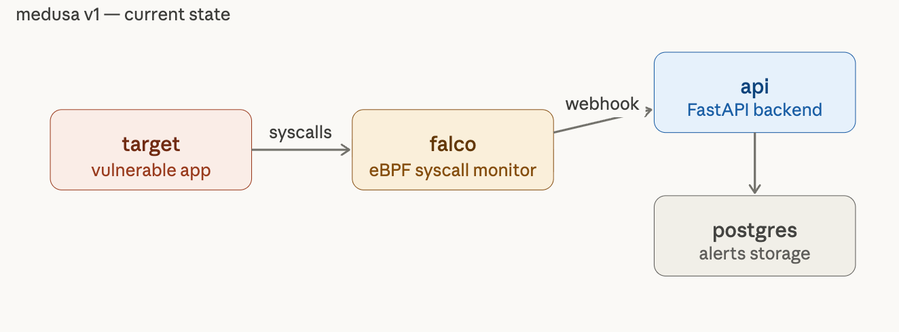

# Medusa

> A container forensics framework for automated evidence capture and attack chain analysis.

Medusa detects attacks on containerised workloads using Falco, automatically captures CRIU memory snapshots on alert, correlates events into MITRE ATT&CK chains, and exposes everything to analysts through a REST API, a React dashboard, and a forensic CLI.

---

## Current state — v1

v1 is the minimal working foundation: a vulnerable target container monitored by Falco, with alerts persisted to PostgreSQL via a FastAPI backend. Analysts can manually trigger CRIU checkpoint capture through the checkpoint-restore-operator via `POST /alerts/manual`.

```
Medusa/
├── docker-compose.yml
├── .env.example
├── docs/
│   ├── api/overview.md
│   ├── architecture/overview.md
│   └── database/
│       ├── schema.md
│       └── er-diagram.md
├── infra/
│   ├── falco/
│   │   ├── falco.yaml              # webhook → POST /alerts/falco
│   │   └── rules/medusa_rules.yaml
│   └── postgres/init/01_schema.sql
└── services/
    ├── api/                        # FastAPI backend
    │   ├── main.py
    │   ├── config.py
    │   ├── forensic_service.py       # shared checkpoint trigger
    │   ├── forensic_chain.py       # ForensicSnapshotChain CR builder
    │   ├── forensic_sync.py        # operator CR status → DB sync
    │   ├── db/session.py
    │   ├── k8s/client.py           # Kubernetes client wrapper
    │   ├── models/
    │   │   ├── alert.py
    │   │   └── forensic.py
    │   └── routers/
    │       ├── alerts.py           # /alerts/falco, /alerts/manual
    │       └── forensic.py         # GET /forensic-checkpoint/{id}
    └── target/                     # intentionally vulnerable app
        └── app/
```

### How v1 works



```
 target  ──syscalls──▶  falco  ──webhook──▶  api  ──▶  postgres
 analyst ──manual────▶  api  ──▶  ForensicSnapshotChain CR  ──▶  operator
```

1. **target** runs a FastAPI app with intentional vulnerabilities (command injection, path traversal, weak SSH).
2. **falco** monitors syscalls via eBPF and sends alerts to **POST `/alerts/falco`**.
3. **api** persists alerts and, on manual trigger (**POST `/alerts/manual`**), creates forensic events and operator CRs.
4. **postgres** stores alerts and forensic event state; a background sync updates phases from operator CR status.

### Quickstart

```bash
cp .env.example .env
docker compose up --build

# verify
curl http://localhost:8000/health
curl "http://localhost:8080/ping?host=localhost;id"   # trigger a Falco alert
curl http://localhost:8000/alerts/
```

### API endpoints (v1)

| Method | Path | Description |
|--------|------|-------------|
| `POST` | `/alerts/falco` | Receive alert from Falco |
| `GET` | `/alerts/` | List all persisted alerts |
| `PUT` | `/alerts/{alert_id}` | Update an existing alert |
| `POST` | `/alerts/manual` | Manually trigger a forensic checkpoint |
| `POST` | `/forensic-checkpoint/falco_alert` | Legacy Falco forensic stub (follow-up) |
| `GET` | `/forensic-checkpoint/{event_id}` | Retrieve a forensic event by ID |
| `GET` | `/health` | Health check |

### API documentation

FastAPI generates interactive and machine-readable API documentation automatically:

| Resource | URL | Description |
|----------|-----|-------------|
| Swagger UI | `/docs` | Interactive API explorer |
| ReDoc | `/redoc` | Read-only reference documentation |
| OpenAPI specification | `/openapi.json` | Machine-readable OpenAPI 3 schema |

An exported copy of the OpenAPI specification is checked into the repository at `docs/api/openapi.json`. See also [`docs/api/overview.md`](docs/api/overview.md) for ingestion flows and forensic event lifecycle details.

---


## Contributing

This project is part of an academic research framework on container forensics.
Issues and pull requests are welcome.
