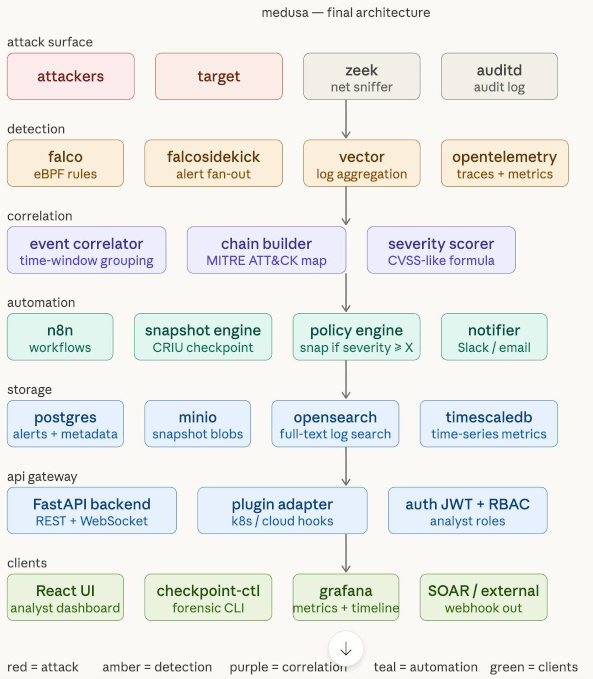

## Roadmap

Final architecture TBC:

---

### v2 - Snapshot automation
**Goal:** when Falco fires, automatically capture a CRIU memory snapshot of the target and store it on MinIO.

New containers: `falcosidekick`, `n8n`, `snapshot-engine`, `minio`, `minio-init`.

- Replace the direct Falco → API webhook with **Falcosidekick** as a fan-out hub. Falcosidekick forwards alerts to both n8n and OpenSearch simultaneously without custom code.
- Add an **n8n workflow** (`infra/n8n/workflows/medusa_alert.json`) that receives the Falcosidekick webhook, calls the snapshot engine, and saves alert metadata to the API.
- Implement the **snapshot engine** (`services/snapshot-engine/`) - a small FastAPI service that receives a container name, runs `docker checkpoint create`, compresses the checkpoint directory, and uploads it to MinIO.
- Add **MinIO** (`infra/minio/`) for S3-compatible blob storage of snapshot archives.
- Extend the API with `/snapshots` endpoints: create, list, get metadata, generate a pre-signed download URL.
- Add a `snapshots` table to PostgreSQL and link it to alerts via `alert_id`.

New files: `services/snapshot-engine/`, `infra/n8n/`, `infra/minio/`, `services/api/routers/snapshots.py`, `services/api/models/snapshot.py`.

---

### v3 - Correlation engine + attack chain builder
**Goal:** group individual Falco alerts into correlated incidents mapped to MITRE ATT&CK for Containers.

New containers: `correlator`, `opensearch`, `vector`.

- Implement the **correlator** (`services/correlator/`) - a FastAPI microservice that polls for new alerts within a configurable time window (default 5 minutes), groups them by container, and matches sequences against `infra/mitre/container_techniques.json` to identify known attack chains (e.g. T1046 → T1110 → T1059).
- Add a composite **severity scorer** - each technique carries a `severity_weight`; the chain score is a weighted sum, producing a CVSS-like numeric score per incident.
- Add an **`incidents` table** to PostgreSQL (linked to alerts and snapshots) to represent a correlated attack event.
- Add **OpenSearch** for full-text search over raw log payloads.
- Add **Vector** (`infra/vector/vector.toml`) to aggregate Zeek network logs and host syslogs into OpenSearch.
- Add **Zeek** to the `attack surface` layer for network-level evidence.
- Add a **policy engine** (`services/policy-engine/`) that reads `infra/policies/snapshot_policy.yaml` and decides whether to trigger a snapshot for a given alert - avoiding expensive CRIU checkpoints on low-priority events.
- Extend the API with `/incidents` endpoints: list, detail, get correlated alerts, get linked snapshots.

New files: `services/correlator/`, `services/policy-engine/`, `infra/mitre/`, `infra/policies/`, `infra/opensearch/`, `infra/vector/`, `services/api/routers/incidents.py`, `services/api/models/incident.py`.

---

### v4 - Analyst dashboard + metrics
**Goal:** give analysts a visual interface to browse incidents, inspect alert timelines, and download snapshots.

New containers: `frontend`, `grafana`, `timescaledb`, `opensearch-dashboards`.

- Build the **React frontend** (`frontend/`) with Vite + TypeScript. Key pages: incident list with severity badges, incident detail with alert timeline and MITRE chain visualisation, snapshot browser with download links, live alert feed via WebSocket.
- Add **Grafana** (`infra/grafana/`) connected to TimescaleDB and PostgreSQL. Pre-built dashboards: alert rate per minute by priority, snapshot latency histogram, attack chain frequency over time. These dashboards produce the figures needed for the paper's evaluation section.
- Add **TimescaleDB** for time-series metrics (alert counts per minute, snapshot durations). Vector feeds network events into it alongside OpenSearch.
- Add **OpenSearch Dashboards** for ad-hoc Lucene queries over raw log data.
- Add **JWT authentication + RBAC** to the API (`services/api/routers/auth.py`) with two roles: `analyst` (read-only) and `admin` (full access).
- Add **attacker containers** (`attackers/`) with `docker compose --profile attack` so experiments can be started in a controlled way.

New files: `frontend/`, `infra/grafana/`, `infra/timescaledb/`, `attackers/`, `services/api/routers/auth.py`, `services/api/models/user.py`.

---

### v5 - Plugin adapter layer + framework generalisation
**Goal:** make Medusa runtime-agnostic so it works on Docker, Kubernetes, and cloud environments without changing client code.

- Implement the **plugin adapter layer** inside the API (`services/api/adapters/`). Define a common `SnapshotAdapter` abstract class with `checkpoint(container_id)` and `restore(snapshot_id)` methods. Ship three concrete adapters: `DockerAdapter` (current CRIU approach), `KubernetesAdapter` (`kubectl debug` + ephemeral containers), `CloudAdapter` (AWS ECS task stop + snapshot via AWS Backup or GCP instance snapshots).
- Add a **`checkpoint-ctl` CLI** (`checkpoint-ctl/`) built with Python `click`. Commands: `list-snapshots`, `download-snapshot`, `list-incidents`, `get-incident`, `replay-snapshot`. The CLI reads from `~/.medusa/config.yaml` and calls the REST API - usable in SOAR playbooks and CI pipelines.
- Add a **`MEDUSA_ADAPTER` environment variable** to the API and snapshot engine to select the active adapter at deploy time.
- Add **Kubernetes manifests** (`deploy/kubernetes/`) for running the full stack on minikube or k3s, replacing Docker Compose for production-like deployments.
- Publish the framework as a **pip-installable package** (`medusa-forensics`) so the snapshot engine and correlator can be imported as libraries in third-party SOAR integrations.

New files: `services/api/adapters/`, `checkpoint-ctl/`, `deploy/kubernetes/`, `pyproject.toml`.

---

## Final architecture

The target architecture after v5 covers seven layers:

| Layer | Containers |
|-------|-----------|
| 0 - attack surface | attackers, target, zeek, auditd |
| 1 - detection | falco, falcosidekick, vector, opentelemetry |
| 2 - correlation | event correlator, chain builder, severity scorer |
| 3 - automation | n8n, snapshot engine, policy engine, notifier |
| 4 - storage | postgres, minio, opensearch, timescaledb |
| 5 - api gateway | FastAPI backend, plugin adapter, auth |
| 6 - clients | React UI, checkpoint-ctl, grafana, SOAR |

---