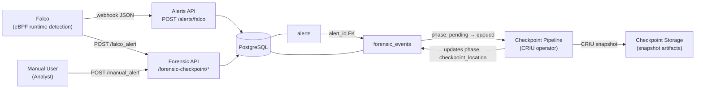

# Architecture Overview

Medusa combines runtime threat detection (Falco), alert persistence (FastAPI + PostgreSQL), and forensic checkpoint capture into a pipeline designed for container incident response.

## System flow

## How the components interact

**Falco** monitors container syscalls via eBPF and fires HTTP webhooks when custom rules match suspicious activity. In the current v1 deployment, Falco sends alerts directly to the **Alerts API**, which normalizes and stores each event in the `alerts` table.

The **Forensic API** provides two entry points. The automatic path (`/forensic-checkpoint/falco_alert`) accepts Falco alert payloads and creates forensic events for checkpoint processing. The manual path (`/forensic-checkpoint/manual_alert`) allows an analyst to trigger a checkpoint with explicit Kubernetes context when automatic enrichment is unavailable.

Both APIs write to **PostgreSQL**. Forensic events optionally reference alerts through a foreign key (`forensic_events.alert_id → alerts.id`), enabling correlation between the original detection and subsequent evidence capture.

The **Checkpoint Pipeline** (planned Kubernetes operator) watches forensic events in `pending` or `queued` phase, resolves container targets, executes CRIU memory snapshots, and writes artifacts to **Checkpoint Storage**. On completion it updates the event phase to `success` or `failed` and records the storage location in `checkpoint_location`.
