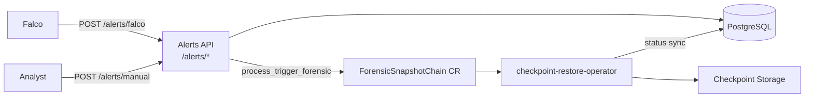

# Architecture Overview

Medusa combines runtime threat detection (Falco), alert persistence (FastAPI + PostgreSQL), and forensic checkpoint capture via the checkpoint-restore-operator.

## System flow




## Component interaction

**Falco** sends runtime alerts to **POST** `/alerts/falco`. The API **always** persists them in the `alerts` table. For Medusa-tagged rules (`tags` includes `medusa`) with Kubernetes context (`k8s.pod.name` in `output_fields`) and priority at or above the configured threshold (default `warning`), it runs the shared forensic trigger (`process_trigger_forensic`, `trigger_source=falco`). Pod-level dedup prevents duplicate CRs while a capture is in flight on the same pod; alert-scoped idempotency prevents duplicate CRs when the same alert row is resubmitted.

**Analysts** trigger checkpoints via **POST** `/alerts/manual` with explicit Kubernetes context. The API creates or links an alert, writes a `forensic_events` record, and creates a **ForensicSnapshotChain** CR (`criu.org/v1`).

The **checkpoint-restore-operator** reconciles the CR, captures CRIU snapshots to storage, and updates CR status. Medusa polls CR status and maps operator phases back to `forensic_events` (e.g. `Completed` → `success`).

**GET** `/forensic-checkpoint/{event_id}` reads forensic state from PostgreSQL.

Forensic events optionally link to alerts via `forensic_events.alert_id → alerts.id`.

## Falco deployment modes

Falco is the runtime sensor that webhooks alerts to the API. Medusa supports two installs:

| Mode | Install | Webhook target | Workloads observed |
| ---- | ------- | -------------- | ------------------ |
| **Docker Compose** | `falco` service in `docker-compose.yml`, config in `infra/falco/falco.yaml` | `http://api:8000/alerts/falco` (Docker DNS) | Compose `target` container |
| **Cluster (Helm)** | `scripts/falco-daemonset-setup.sh` | `http://<NODE_IP>:8000/alerts/falco` | Kubernetes pods cluster-wide |

Both load [`infra/falco/rules/medusa_rules.yaml`](../../infra/falco/rules/medusa_rules.yaml). Medusa custom rules carry the `medusa` tag, which gates automatic forensic capture on ingest. Cluster Falco provides `k8s.ns.name` and `k8s.pod.name` in `output_fields` for pod workloads — required for CR creation. Compose Falco against the lab `target` typically lacks pod metadata; alerts are still stored.

See [`docs/installation/falco.md`](../installation/falco.md) for setup, env vars, and troubleshooting. Do not run both Falco installs simultaneously unless you intend to.

## Local development stack (Docker Compose)

The v1 lab can run four services on the shared `medusa-lab-net` bridge network (omit `falco` when using cluster Helm Falco instead):

```
┌─────────┐  syscalls   ┌───────┐  http://api:8000/alerts/falco   ┌─────┐  postgres:5432  
│ target  │ ──────────▶│ falco │ ─────────────────────────────▶ │ api │ ──────────────▶    postgres  │
└─────────┘             └───────┘                                 └──┬──┘                
                                                                     │
                                                              kubeconfig + checkpoints
                                                                     ▼
                                                            Kubernetes (ForensicSnapshotChain CR)
```


| Service    | Network   | Role                                                                                 |
| ---------- | --------- | ------------------------------------------------------------------------------------ |
| `target`   | `lab-net` | Vulnerable app; Falco monitors its syscalls via the Docker socket.                   |
| `falco`    | `lab-net` | Sends webhook alerts to `http://api:8000/alerts/falco`.                              |
| `api`      | `lab-net` | FastAPI backend; published as `localhost:8000` on the host.                          |
| `postgres` | `lab-net` | Alert and forensic event persistence; API uses `DATABASE_URL=...@postgres:5432/...`. |


**Kubernetes from the API container:** the host kubeconfig is mounted read-only at `/kube/config`. The apiserver `server` URL must resolve from inside the container (typically the node internal IP, e.g. `https://10.0.2.15:6443`). A loopback URL such as `https://127.0.0.1:6443` only works when the API uses host networking and breaks Falco webhook delivery to `api:8000`.

**Checkpoint volumes:** `/var/lib/kubelet/checkpoints` on the host is mounted into the API so sync logic can read operator checkpoint paths.