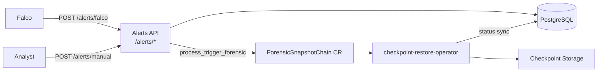

# Architecture Overview

Medusa combines runtime threat detection (Falco), alert persistence (FastAPI + PostgreSQL), and forensic checkpoint capture via the checkpoint-restore-operator.

## System flow

## Component interaction

**Falco** sends runtime alerts to **POST `/alerts/falco`**, which persists them in the `alerts` table.

**Analysts** trigger checkpoints via **POST `/alerts/manual`** with explicit Kubernetes context. The API creates or links an alert, writes a `forensic_events` record, and creates a **ForensicSnapshotChain** CR (`criu.org/v1`).

The **checkpoint-restore-operator** reconciles the CR, captures CRIU snapshots to storage, and updates CR status. Medusa polls CR status and maps operator phases back to `forensic_events` (e.g. `Completed` → `success`).

**GET `/forensic-checkpoint/{event_id}`** reads forensic state from PostgreSQL. Unified Falco automation via `/alerts/falco` and removal of the legacy `/forensic-checkpoint/falco_alert` stub are follow-up work.

Forensic events optionally link to alerts via `forensic_events.alert_id → alerts.id`.
