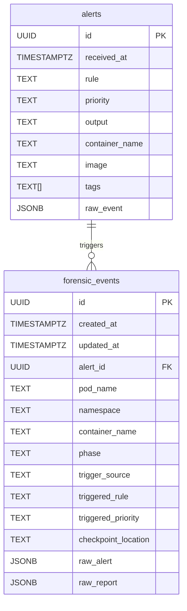

# Entity-Relationship Diagram

The diagram below shows the relationship between the core Medusa tables for alerts and forensic events.

## Relationship semantics

- One **alert** may trigger **zero or more** forensic events (`||--o{`).
- Each forensic event optionally references exactly one alert via `forensic_events.alert_id`.
- The foreign key is nullable: forensic events can exist without a linked alert row.
