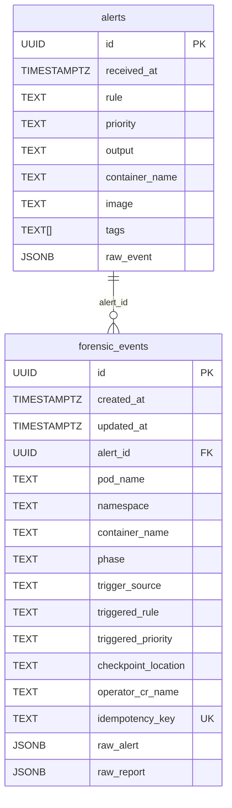

# Entity-Relationship Diagram

## Relationship semantics

- One **alert** may have **zero or more** forensic events.
- Each forensic event optionally references one alert via `forensic_events.alert_id` (nullable FK).
- **Manual flow:** `POST /alerts/manual` creates a new alert or links via optional `alert_id`.
- **`idempotency_key`** is unique per event — used to deduplicate triggers within a time window.
- **`operator_cr_name`** links the DB row to the `ForensicSnapshotChain` CR in Kubernetes.
