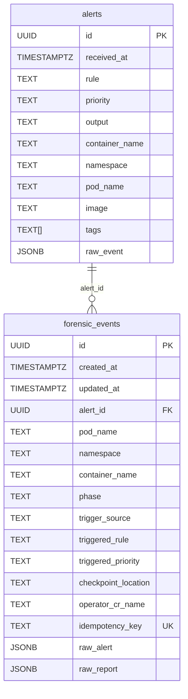

# Entity-Relationship Diagram

## Relationship semantics

- One **alert** may have **zero or more** forensic events (typically zero or one per alert when forensic triggering succeeds).
- Each forensic event optionally references one alert via `forensic_events.alert_id` (nullable FK). Pod dedup may return an event whose `alert_id` points to an earlier alert in the same burst.
- **Falco flow:** `POST /alerts/falco` always persists the alert; forensic trigger runs when `medusa` tag, k8s context, and priority threshold are met.
- **Manual flow:** `POST /alerts/manual` creates a new alert or links via optional `alert_id`.
- **Pod dedup:** Active captures (`queued` / `in_progress`) on the same pod reuse one `forensic_events` row across distinct alerts.
- **`idempotency_key`** is unique per event - SHA-256 of `{alert_id}:{namespace}:{pod_name}:{container_name}`. Duplicate submits for the same alert reuse the row; missing or failed CRs trigger recreation on that row.
- **`operator_cr_name`** links the DB row to the `ForensicSnapshotChain` CR in Kubernetes.
- **`raw_report`** is nested JSONB: `operator` (status sync), `checkpointctl` (analysis ingest API), optional `error` (CR create failures). Writers update only their own key.
